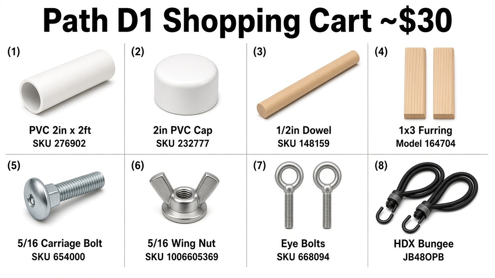
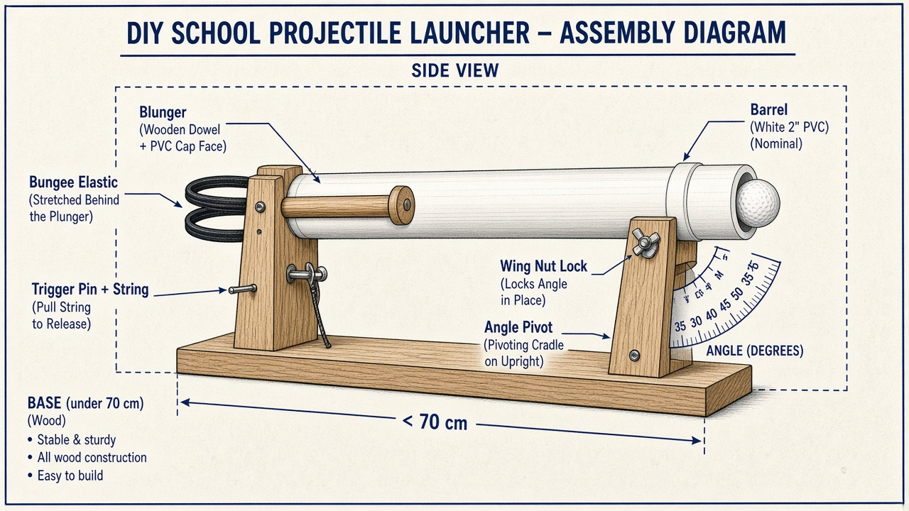
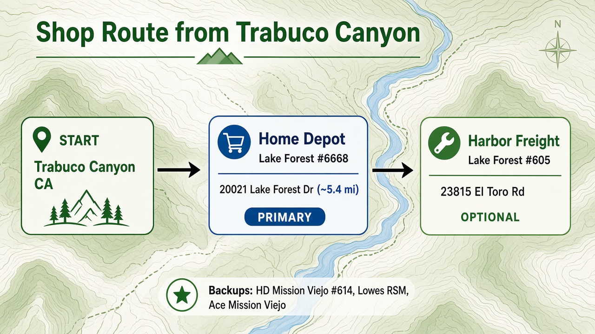

# AP Physics Projectile Launcher — Shopping & Build Guide

**Location:** Trabuco Canyon, CA  
**Hard budget:** **$40 maximum** (assignment rule — keep every receipt)  
**Recommended cart (Path D1):** ~**$27.71** before tax → ~**$29.86** after ~7.75% OC tax  
**Design:** Elastic-powered **2" PVC barrel** launcher with plunger, string-pull trigger, and marked angles 35°–55°

---

## Visual overview

### Path D1 product collage (buy these)



### How the finished launcher is assembled



### Where to drive from Trabuco Canyon



---

## Constraint checklist (every rubric limit)

| Requirement | How this cart fulfills it |
|---|---|
| Launch a **golf ball** to a target **4–6 m** away, elevated up to **1.5 m** | 2" Sch 40 PVC fits a ~1.68" golf ball; bungee loops can reach competition range and the **8 m** test-fire |
| Launcher fits in a **70 cm cube** | Cut barrel to ≤55 cm; keep base/height ≤60 cm |
| Propulsion through a **barrel or track** (no catapult / trebuchet) | PVC barrel + sliding plunger |
| **≥5 calibrated angles** covering **35°–55°** | Pivot + wing-nut lock; mark **35 / 40 / 45 / 50 / 55** |
| **Functional trigger** released without contacting other parts | Pin through barrel into plunger notch; **pull string sideways** to fire |
| **No prefabricated launch mechanisms** | Raw pipe, wood, fasteners, bungee — you build the mechanism |
| **≤ $40** with receipts | Path D1 totals ~$30 after tax |
| Test-fire day: **≥ 8 m** | Use 3–4 bungee strands and a deeper pull-back notch |

**Do not buy**

- 1½" PVC (inside diameter too small for a golf ball)
- Prefab launch kits, Nerf/airsoft guns, potato-cannon kits
- Catapult / trebuchet parts
- Everbilt latex hose Model `769355` (~$24) — blows the budget
- Anything that pushes the **total over $40** even if under $50

---

## Store route (Trabuco Canyon)

1. **Primary — Home Depot Lake Forest #6668**  
   20021 Lake Forest Dr, Lake Forest, CA 92630 (~5.4 mi)  
   Buy almost everything here in one trip.

2. **Optional — Harbor Freight Lake Forest #605**  
   23815 El Toro Rd, Lake Forest, CA 92630  
   Only if you choose **Path D2** elastic pack instead of HDX bungees.

3. **Backups**  
   - Home Depot Mission Viejo #614 — 27952 Hillcrest  
   - Lowe’s Rancho Santa Margarita — 30481 Avenida de las Flores  
   - Ace Hardware Mission Viejo — 26006 Marguerite Pkwy  
   - Dollar Tree / Target — protractor + twine  
   - Walmart Neighborhood Market RSM — 30491 Avenida de las Flores (golf balls if needed)

Bring this guide (or a phone photo of the SKU table) and ask the Pro Desk for aisle locations.

---

## Exact shopping list — Path D1 (recommended)

Buy these **specific item numbers**. Prices are recent online list prices; confirm at the register and keep receipts.

### A) Barrel + plunger

| # | Item | Identifiers | Qty | Price | Use |
|---|---|---|---|---|---|
| 1 | Charlotte Pipe **2 in. × 2 ft.** PVC DWV Schedule 40 Pipe | Internet **`100585960`** · Store SKU **`276902`** · Model **`PVC072000200HA`** | 1 | ~$6.98 | Barrel — cut to ~50–55 cm. **Must be 2"** |
| 2 | Charlotte Pipe **2 in.** PVC Socket Schedule 40 Pressure Cap | Internet **`203811678`** · Store SKU **`232777`** · Model **`PVC021161600HD`** | 1 | ~$2.60 | Plunger face — drill centered hole for dowel |
| 3 | Hardwood round dowel **1/2 in. × 48 in.** | Internet **`203334064`** · Store SKU **`148159`** · Model **`10001804`** (6408U) | 1 | ~$2.18 | Plunger rod — cut ~45–50 cm; file trigger notch |

### B) Frame + angle adjust

| # | Item | Identifiers | Qty | Price | Use |
|---|---|---|---|---|---|
| 4 | **1×3×8 ft** furring strip (or 1×4 if 1×3 missing) | Model **`164704`** | **2** | ~$2.47 ea ($4.94) | Base, uprights, cradle. Skip if you have scrap lumber |
| 5 | Everbilt **5/16 in.-18 × 4 in.** zinc carriage bolt | Internet **`204633697`** · Store SKU **`654000`** · Model **`800186`** | 1 | ~$0.81 | Angle pivot |
| 6 | Everbilt **5/16 in.-18** zinc wing nut (3-pack) | Internet **`317479001`** · Store SKU **`1006605369`** · Model **`828911`** | 1 pack | ~$1.38 | Hand-lock launch angle |
| 7 | **5/16 in.** flat washers (bulk bin) | Fastener aisle | 2–4 | ~$1.00 | Smooth pivot; protect wood |

### C) Trigger + fasteners

| # | Item | Identifiers | Qty | Price | Use |
|---|---|---|---|---|---|
| 8 | Everbilt **1/4 in. × 4 in.** zinc eye bolts with nuts (2-pack) | Internet **`204273514`** · Store SKU **`668094`** · Model **`816751`** | 1 pack | ~$1.47 | Bungee anchors; optional string guide |
| 9 | Long nail / smooth steel pin **~3–4 in.** | Fastener bin | 1 | ~$0.25 | Trigger pin through barrel into plunger notch |
| 10 | **#8 × 1-1/4 in.** wood screws | Bulk bin (~20 pieces) | ~20 | ~$2.00 | Assemble frame; clamp barrel straps |

### D) Elastic propulsion — Path D1

| # | Item | Identifiers | Qty | Price | Use |
|---|---|---|---|---|---|
| 11 | HDX **48 in.** Standard Bungee Cord | Model **`JB48OPB`** · Internet **`206802336`** | **4** | ~$0.40 ea ($1.60) | Cut off hooks; loop 2–4 strands behind plunger |

### E) Calibration / consumables

| # | Item | Where | Qty | Price | Use |
|---|---|---|---|---|---|
| 12 | School protractor | Dollar Tree / Target / school | 1 | ~$1.00–$1.50 | Verify angle marks |
| 13 | Twine / mason line | Dollar Tree or HD | 1 | ~$1.25 | Trigger pull string |
| 14 | Golf balls | Borrow first; Walmart RSM if needed | 2–3 | $0 if borrowed | Required projectile |

---

## Path D2 elastic swap (optional)

If you want more cord lengths for light/medium/heavy velocity settings:

| Item | Store | SKU | Price |
|---|---|---|---|
| HAUL-MASTER Assorted Length Elastic Stretch Cords, 18-Piece | Harbor Freight Lake Forest | **`60811`** (also 91241 / 62964) | **$12.99** |

**To stay ≤ $40 after tax with Path D2:** skip the protractor if school already has one, **or** buy only **1** furring strip if you have scrap wood. Do **not** stack Path D1 bungees + Path D2 pack.

---

## Budget verification — Path D1 (final)

| Line | Amount |
|---|---|
| PVC 2" × 2' (SKU 276902) | $6.98 |
| PVC cap (SKU 232777) | $2.60 |
| Dowel (SKU 148159) | $2.18 |
| Furring ×2 (Model 164704) | $4.94 |
| Carriage bolt (SKU 654000) | $0.81 |
| Wing nut pack (SKU 1006605369) | $1.38 |
| Washers (bulk) | $1.00 |
| Eye bolts (SKU 668094) | $1.47 |
| Pin/nail (bulk) | $0.25 |
| Screws bulk | $2.00 |
| HDX bungee ×4 (JB48OPB) | $1.60 |
| Protractor + twine | $2.50 |
| **Subtotal before tax** | **$27.71** |
| **Est. Orange County sales tax (~7.75%)** | **$2.15** |
| **Estimated grand total** | **$29.86** |
| **Assignment limit** | **$40.00** |
| **Headroom remaining** | **~$10.14** |

### Receipt checklist (print / screenshot before you leave the store)

- [ ] Home Depot receipt shows each SKU / description
- [ ] Dollar Tree / Target receipt for protractor + twine (if bought)
- [ ] Golf-ball receipt only if purchased
- [ ] Handwritten note of bulk-bin items (washers, screws, pin) with prices
- [ ] Running total ≤ **$40.00** including tax
- [ ] Photos of receipts saved to phone + paper copies in the project folder

---

## Build steps (map parts → rubric points)

1. **Base** — Cut furring into a wide rectangle (~50 × 25 cm) so the launcher does not tip when elastic fires. Overall envelope must stay inside **70 cm**.
2. **Uprights** — Two vertical pieces with aligned holes for the carriage bolt.
3. **Cradle** — Wood U-channel that clamps the PVC; swings on the bolt; wing nut locks angle.
4. **Barrel** — Cut 2" PVC to ~50–55 cm. Drill one small breech hole for the trigger pin. Sand the muzzle smooth.
5. **Plunger** — Drill the PVC cap; fasten the dowel centered. File a notch near the rear of the dowel for the pin. Front face pushes the golf ball.
6. **Elastic** — Loop HDX bungees from rear eye bolts / cradle anchors to a cross-pin on the plunger so stretch energy drives **along the barrel axis** (not a swinging arm).
7. **Trigger** — Cock plunger → insert pin → stand clear → pull twine **sideways** so the pin clears without your hand touching any other part of the launcher.
8. **Angles** — With a protractor, mark and label **35°, 40°, 45°, 50°, 55°** on an upright (add finer ticks if you want). First competition launch must use a **calculated** angle.
9. **Velocity data (lab write-up)** — Collect typed range data at a fixed angle. Calculate launch speed from distance and angle only (no stopwatch), e.g.  
   \( v = \sqrt{\dfrac{R g}{\sin 2\theta}} \) for landing at the same height, or the elevated-target form when the target is up to 1.5 m high. Use enough trials for a reliable average.

---

## Test-fire & competition tips

- **Test-fire (≥ 8 m):** Use 3–4 bungee strands and a deeper cocking notch; measure on flat ground.
- **Impound day:** Target distance/elevation announced — bring calculator and pre-derived formulas for angle/velocity.
- **Competition:** Up to **3 launches in 6 minutes**; first launch must use your calculated angle.
- **Aesthetics (compensatory pts):** Paint/stain only if still under $40 — symmetry and sturdy joints matter more than decoration.

---

## Borrow first (free, still legal)

- Saw, drill, screwdriver, sandpaper, Sharpie, measuring tape
- School protractor (skip buying #12)
- Scrap 2×4 / plywood (skip or reduce furring)
- Golf balls from a range bucket / family stash

---

## Quick SKU cheat sheet (Path D1 — Home Depot Lake Forest)

```
276902     2" x 2' PVC Sch 40          ~$6.98
232777     2" PVC pressure cap         ~$2.60
148159     1/2" x 48" hardwood dowel   ~$2.18
164704     1x3x8 furring (buy 2)       ~$2.47 ea
654000     5/16-18 x 4" carriage bolt  ~$0.81
1006605369 5/16 wing nut 3-pack        ~$1.38
668094     1/4 x 4" eye bolts 2-pack   ~$1.47
JB48OPB    HDX 48" bungee (buy 4)      ~$0.40 ea
+ bulk     washers, #8 screws, 3-4" pin
```

**Stay under $40. Keep every receipt. Build the mechanism yourself.**
