# AP Physics Projectile Launcher — Shopping & Build Guide

**Location:** Trabuco Canyon, CA  
**Hard budget:** **$40 maximum** (assignment rule — keep every receipt)  
**Recommended cart (Path D1):** ~**$27.71** before tax → ~**$29.86** after ~7.75% OC tax  
**Design:** Elastic-powered **2" PVC barrel** launcher with plunger, string-pull trigger, and marked angles 35°–55°

---

## Visual overview

### Path D1 product collage (buy these)

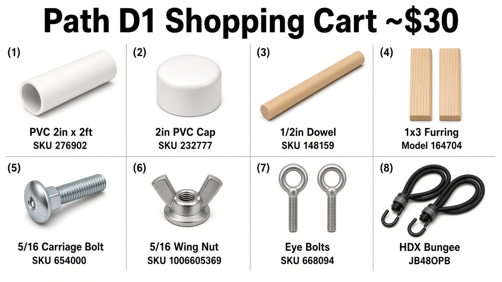

### How the finished launcher is assembled

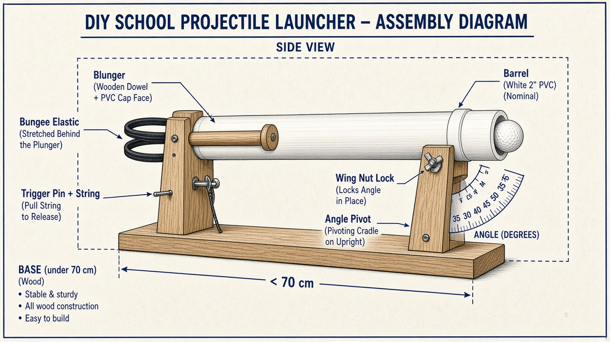

### Angle vs pullback vs trigger (read this if the diagram feels confusing)

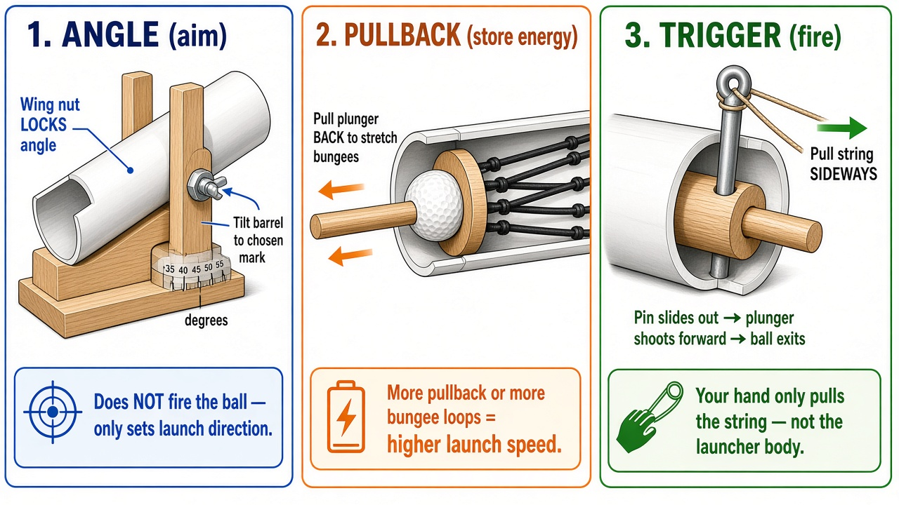

These are **three different jobs**. Mixing them up is the usual source of confusion.

| System | What it controls | What you move | What it does *not* do |
|---|---|---|---|
| **1. Angle** | Launch **direction** (up/down) | Tilt the barrel cradle on the carriage-bolt pivot, then tighten the **wing nut** | Does not store energy or fire the ball |
| **2. Pullback** | Launch **speed** (how hard) | Pull the plunger **backward** so the bungees stretch | Does not set the angle |
| **3. Trigger** | **When** it fires | Pull the string **sideways** so the pin slides out | Your hand must not hold/release the elastic itself |

**1. Angle system (aim)** — see blueprints below for the exact joint  
**2. Pullback (store energy)** — pull plunger back to stretch bungees (speed only)  
**3. Trigger (fire)** — pin holds the cocked plunger; pull string sideways to release  

**One firing sequence**
1. Loosen wing nut → rotate cradle to angle mark → tighten wing nut  
2. Load golf ball → pull plunger back (stretch bungees) → insert pin  
3. Clear the area → pull trigger string sideways → ball launches  

### Angle joint blueprints (how the adjustable angle actually works)

**Start with this sheet** — it is an exact cut-and-assemble sequence:

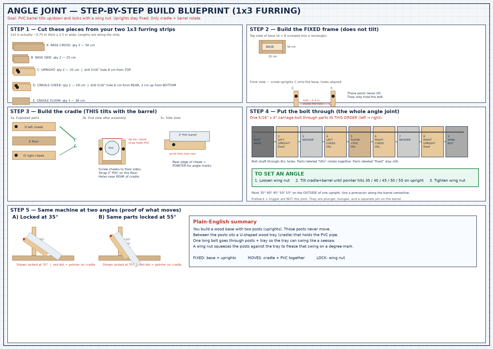

The angle is **not** a door hinge on the barrel. It is a **friction clamp / seesaw**:

1. Cut the 1×3 pieces (A–E) and drill the 5/16" holes where marked.
2. Screw base A+B, then screw uprights **C** to the base (**fixed** — they never tilt).
3. Build cradle **D+E**, strap the PVC on it (**this tilts**).
4. Bolt through: upright → washer → cheek → floor/barrel → cheek → washer → upright → **wing nut**.
5. Loosen wing nut → tilt cradle to 35/40/45/50/55 → tighten wing nut.

Extra orthographic views (same joint):

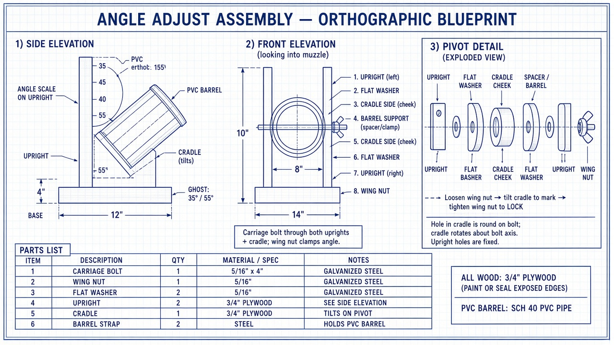

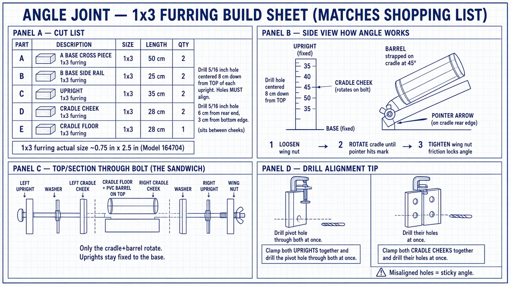

#### Cut list from the two 1×3×8 ft furring strips (Model `164704`)

| Part | Qty | Length | Drill |
|---|---|---|---|
| A — Base cross piece | 2 | 50 cm | — |
| B — Base side rail | 2 | 25 cm | — |
| C — Upright | 2 | 35 cm | 5/16" hole, centered, **8 cm down from top** |
| D — Cradle cheek | 2 | 28 cm | 5/16" hole, **6 cm from rear**, **3 cm up from bottom** |
| E — Cradle floor | 1 | 28 cm | — (sits between the two cheeks) |

Actual 1×3 size is about **0.75" × 2.5"**.

#### Bolt sandwich order (front view through the pivot)

`bolt head → left upright C → washer → left cheek D → cradle floor E (+ barrel on top) → right cheek D → washer → right upright C → wing nut`

**Only the cradle + barrel rotate.** Uprights stay fixed. Clamp both uprights together and drill once; clamp both cheeks together and drill once.

#### Paint the angle scale

1. Temporarily tighten near 45°.  
2. Use a protractor along the barrel centerline.  
3. Mark **35°, 40°, 45°, 50°, 55°** on the outside of one upright.  
4. Put a Sharpie pointer on the cradle cheek that lines up with those marks.

#### How the wing nut relates to exact degrees (important)

**The wing nut does not choose 35° vs 55°.** It only locks or unlocks.

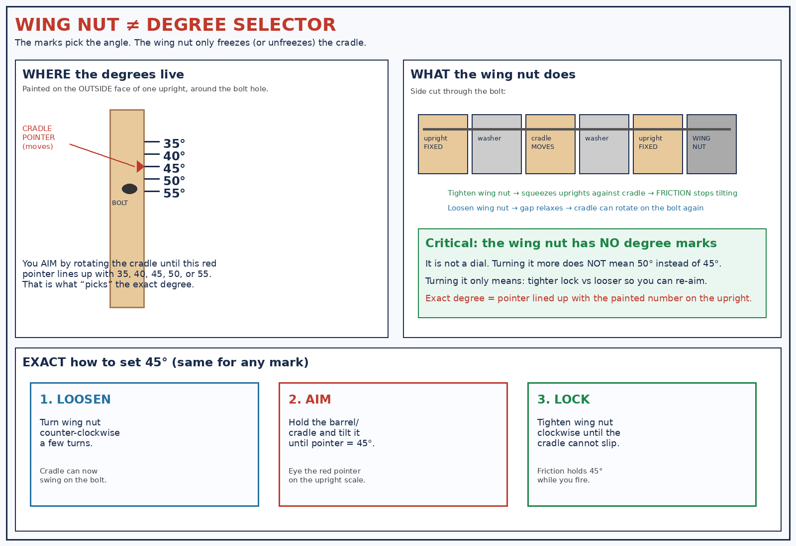

| Part | Job |
|---|---|
| **Painted marks on the upright** (35 / 40 / 45 / 50 / 55) | These are the degree choices |
| **Pointer on the cradle** | You tilt until this lines up with a mark |
| **Wing nut** | Loosen = allow tilt; tighten = squeeze uprights against cradle so friction freezes that aim |

**To set exactly 45°:** loosen wing nut → tilt cradle until pointer hits the **45°** paint mark → tighten wing nut until it won’t slip → then cock/fire. Turning the wing nut more does *not* increase the angle; it only clamps harder.

#### What each metal piece does (simplest version)

You already have the wood right: **two posts + cradle for PVC + bolt so it can rotate.**

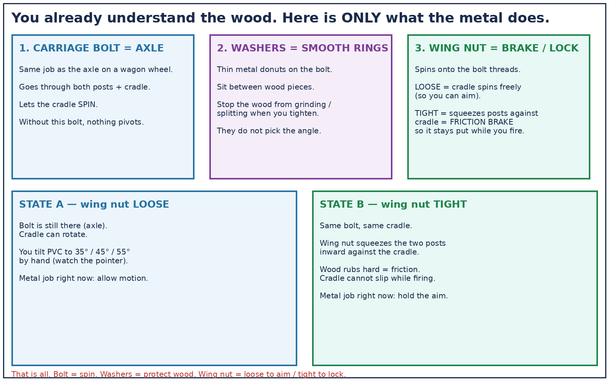

| Metal | Job in one word | What it does |
|---|---|---|
| **Carriage bolt** | Axle | Goes through posts + cradle so the cradle can spin |
| **Washers** | Protectors | Metal rings so tightening doesn’t chew up the wood |
| **Wing nut** | Brake | Screws onto the bolt’s threads. **Loose** = spin/aim. **Tight** = squeeze posts against cradle so friction holds the angle while you fire |

That is the whole metal story. The bolt does not pick degrees. The wing nut does not pick degrees. You aim by tilting the cradle to a painted mark; the wing nut only switches between “can move” and “stays put.”

#### Why there are TWO posts (and will the cradle hit the base?)

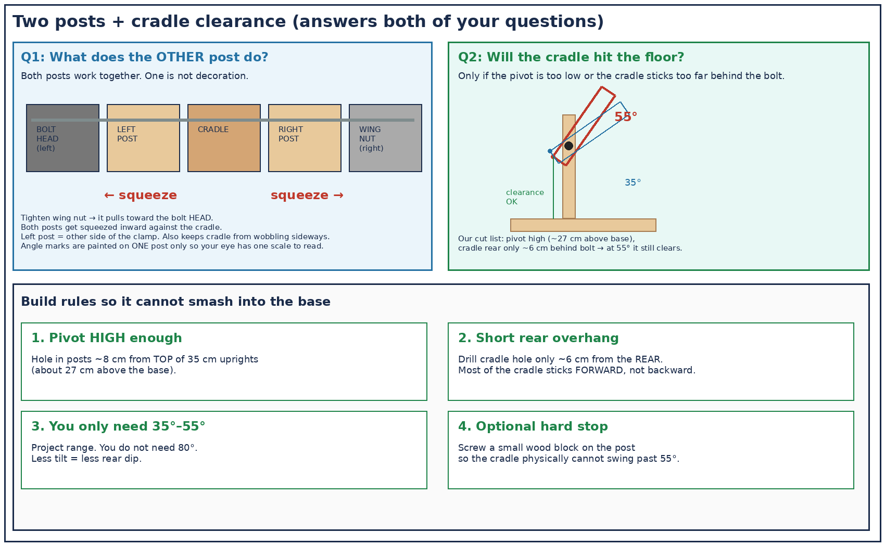

**Other post:** The bolt head is on one side, the wing nut on the other. Tightening pulls them together, so **both posts squeeze the cradle**. The second post is the other jaw of the clamp and also stops sideways wobble. You only *paint* the degree marks on one post so your eye has one scale.

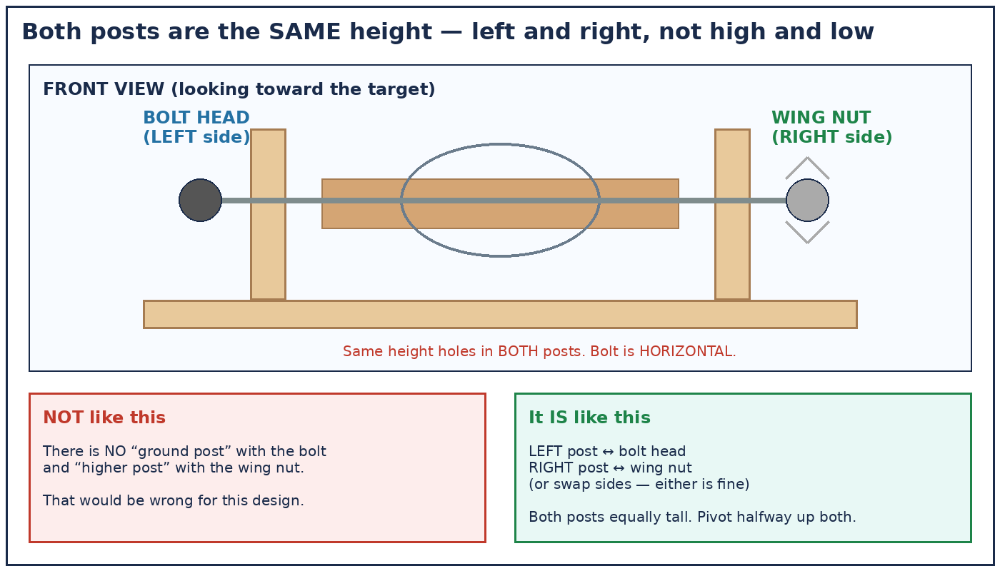

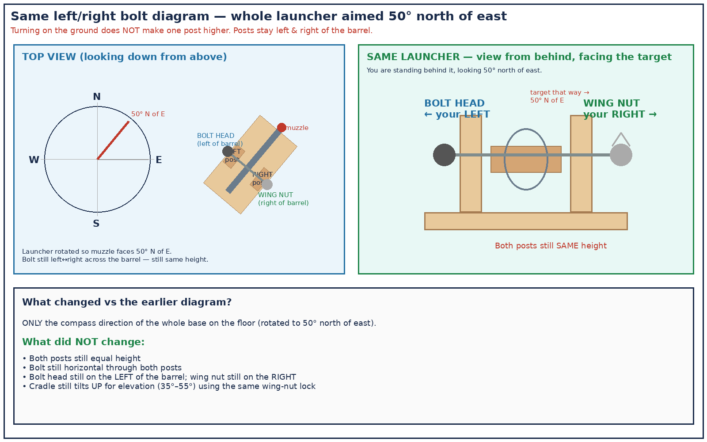

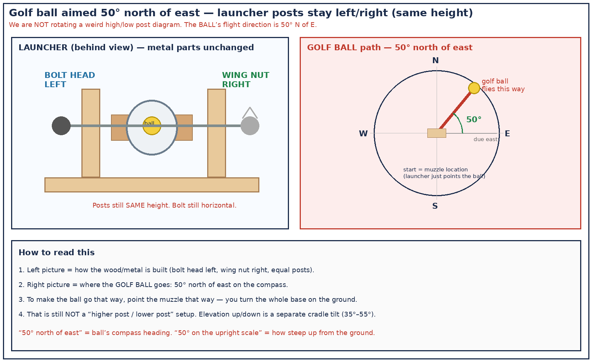

**Not high vs low:** both posts are equally tall. The bolt is **horizontal** through matching holes. Put the **bolt head on the left** and the **wing nut on the right** (or swap — either works). There is no “near the ground” metal piece and “higher” metal piece. If the **golf ball** should go **50° north of east**, that is the ball’s compass path — point the muzzle that way (turn the base). Posts stay left/right at the same height; we do not rebuild them high/low.

#### Elevation vs compass direction (“50° north of east”)

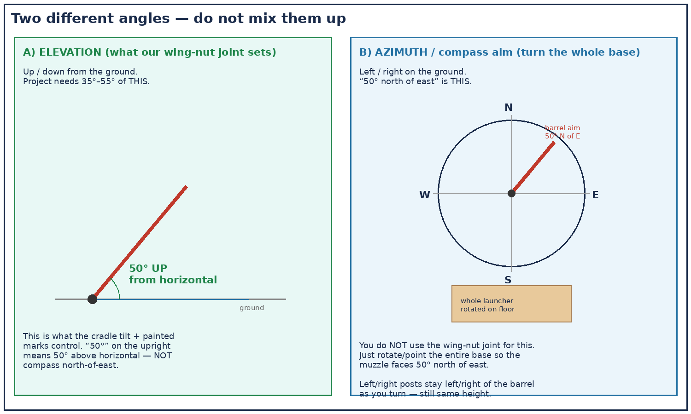

These are **two different angles**:

| Kind | Meaning | How you set it on this launcher |
|---|---|---|
| **Elevation** | How far **up** from horizontal (project: 35°–55°) | Tilt cradle; lock with wing nut; read painted marks |
| **Azimuth / compass** | Which way you face on the ground (e.g. 50° north of east) | **Turn the whole base** so the muzzle points that way |

“50° north of east” is **not** what the cradle joint is for, and it is **not** “shooting at 90°.” Facing east with the barrel tilted 50° up is elevation 50°. Facing 50° north of east is just rotating the launcher on the floor; left/right posts stay left/right of the barrel.

**Hitting the floor:** Can happen only if the pivot is too low or the cradle sticks too far behind the bolt (rear dips as angle goes up). With this cut list it should clear:
- pivot high (~8 cm from top of 35 cm posts)
- cradle hole only ~6 cm from the rear (most length points forward)
- you only need **35°–55°**, not near-vertical

Optional: screw a small wood stop on a post so the cradle cannot swing past 55°.

#### What the wing nut screws onto (and why straight posts are fine)

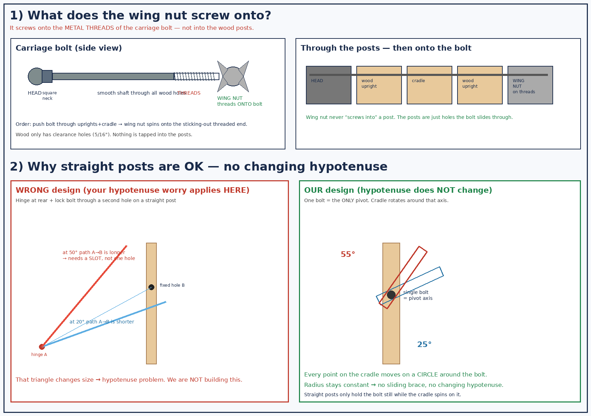

1. **What it screws onto:** the **metal threads of the carriage bolt**.  
   Push the bolt through the wood holes → the threaded end sticks out past the second upright → spin the wing nut onto that threaded end.  
   The wood only has clearance holes (5/16"). You are **not** screwing the wing nut into a post.

2. **Why your hypotenuse worry does not apply here:** that problem happens if you hinge the barrel at one place (A) and try to pin it through a **second** fixed hole (B) on a straight post — then distance A→B changes with angle, so you’d need a slot.  
   **Our joint uses one bolt as the only pivot.** The cradle spins in a circle around that bolt. Radius stays constant, so straight posts are fine — they just hold the bolt still while the cradle rotates on it.

### Where to drive from Trabuco Canyon

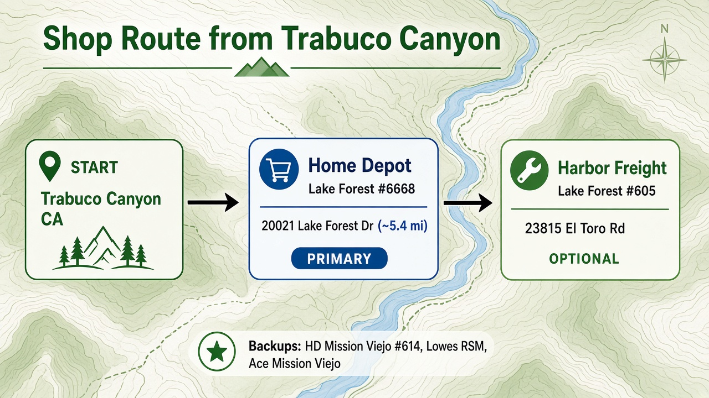

---

## Constraint checklist (every rubric limit)

| Requirement | How this cart fulfills it |
|---|---|
| Launch a **golf ball** to a target **4–6 m** away, elevated up to **1.5 m** | 2" Sch 40 PVC fits a ~1.68" golf ball; bungee loops can reach competition range and the **8 m** test-fire |
| Launcher fits in a **70 cm cube** | Cut barrel to ≤55 cm; keep base/height ≤60 cm |
| Propulsion through a **barrel or track** (no catapult / trebuchet) | PVC barrel + sliding plunger |
| **≥5 calibrated angles** covering **35°–55°** | Pivot + wing-nut lock; mark **35 / 40 / 45 / 50 / 55** |
| **Functional trigger** released without contacting other parts | Pin through barrel into plunger notch; **pull string sideways** to fire |
| **No prefabricated launch mechanisms** | Raw pipe, wood, fasteners, bungee — you build the mechanism |
| **≤ $40** with receipts | Path D1 totals ~$30 after tax |
| Test-fire day: **≥ 8 m** | Use 3–4 bungee strands and a deeper pull-back notch |

**Do not buy**

- 1½" PVC (inside diameter too small for a golf ball)
- Prefab launch kits, Nerf/airsoft guns, potato-cannon kits
- Catapult / trebuchet parts
- Everbilt latex hose Model `769355` (~$24) — blows the budget
- Anything that pushes the **total over $40** even if under $50

---

## Store route (Trabuco Canyon)

1. **Primary — Home Depot Lake Forest #6668**  
   20021 Lake Forest Dr, Lake Forest, CA 92630 (~5.4 mi)  
   Buy almost everything here in one trip.

2. **Optional — Harbor Freight Lake Forest #605**  
   23815 El Toro Rd, Lake Forest, CA 92630  
   Only if you choose **Path D2** elastic pack instead of HDX bungees.

3. **Backups**  
   - Home Depot Mission Viejo #614 — 27952 Hillcrest  
   - Lowe’s Rancho Santa Margarita — 30481 Avenida de las Flores  
   - Ace Hardware Mission Viejo — 26006 Marguerite Pkwy  
   - Dollar Tree / Target — protractor + twine  
   - Walmart Neighborhood Market RSM — 30491 Avenida de las Flores (golf balls if needed)

Bring this guide (or a phone photo of the SKU table) and ask the Pro Desk for aisle locations.

---

## Exact shopping list — Path D1 (recommended)

Buy these **specific item numbers**. Prices are recent online list prices; confirm at the register and keep receipts.

### A) Barrel + plunger

| # | Item | Identifiers | Qty | Price | Use |
|---|---|---|---|---|---|
| 1 | Charlotte Pipe **2 in. × 2 ft.** PVC DWV Schedule 40 Pipe | Internet **`100585960`** · Store SKU **`276902`** · Model **`PVC072000200HA`** | 1 | ~$6.98 | Barrel — cut to ~50–55 cm. **Must be 2"** |
| 2 | Charlotte Pipe **2 in.** PVC Socket Schedule 40 Pressure Cap | Internet **`203811678`** · Store SKU **`232777`** · Model **`PVC021161600HD`** | 1 | ~$2.60 | Plunger face — drill centered hole for dowel |
| 3 | Hardwood round dowel **1/2 in. × 48 in.** | Internet **`203334064`** · Store SKU **`148159`** · Model **`10001804`** (6408U) | 1 | ~$2.18 | Plunger rod — cut ~45–50 cm; file trigger notch |

### B) Frame + angle adjust

| # | Item | Identifiers | Qty | Price | Use |
|---|---|---|---|---|---|
| 4 | **1×3×8 ft** furring strip (or 1×4 if 1×3 missing) | Model **`164704`** | **2** | ~$2.47 ea ($4.94) | Base, uprights, cradle. Skip if you have scrap lumber |
| 5 | Everbilt **5/16 in.-18 × 4 in.** zinc carriage bolt | Internet **`204633697`** · Store SKU **`654000`** · Model **`800186`** | 1 | ~$0.81 | Angle pivot |
| 6 | Everbilt **5/16 in.-18** zinc wing nut (3-pack) | Internet **`317479001`** · Store SKU **`1006605369`** · Model **`828911`** | 1 pack | ~$1.38 | Hand-lock launch angle |
| 7 | **5/16 in.** flat washers (bulk bin) | Fastener aisle | 2–4 | ~$1.00 | Smooth pivot; protect wood |

### C) Trigger + fasteners

| # | Item | Identifiers | Qty | Price | Use |
|---|---|---|---|---|---|
| 8 | Everbilt **1/4 in. × 4 in.** zinc eye bolts with nuts (2-pack) | Internet **`204273514`** · Store SKU **`668094`** · Model **`816751`** | 1 pack | ~$1.47 | Bungee anchors; optional string guide |
| 9 | Long nail / smooth steel pin **~3–4 in.** | Fastener bin | 1 | ~$0.25 | Trigger pin through barrel into plunger notch |
| 10 | **#8 × 1-1/4 in.** wood screws | Bulk bin (~20 pieces) | ~20 | ~$2.00 | Assemble frame; clamp barrel straps |

### D) Elastic propulsion — Path D1

| # | Item | Identifiers | Qty | Price | Use |
|---|---|---|---|---|---|
| 11 | HDX **48 in.** Standard Bungee Cord | Model **`JB48OPB`** · Internet **`206802336`** | **4** | ~$0.40 ea ($1.60) | Cut off hooks; loop 2–4 strands behind plunger |

### E) Calibration / consumables

| # | Item | Where | Qty | Price | Use |
|---|---|---|---|---|---|
| 12 | School protractor | Dollar Tree / Target / school | 1 | ~$1.00–$1.50 | Verify angle marks |
| 13 | Twine / mason line | Dollar Tree or HD | 1 | ~$1.25 | Trigger pull string |
| 14 | Golf balls | Borrow first; Walmart RSM if needed | 2–3 | $0 if borrowed | Required projectile |

---

## Path D2 elastic swap (optional)

If you want more cord lengths for light/medium/heavy velocity settings:

| Item | Store | SKU | Price |
|---|---|---|---|
| HAUL-MASTER Assorted Length Elastic Stretch Cords, 18-Piece | Harbor Freight Lake Forest | **`60811`** (also 91241 / 62964) | **$12.99** |

**To stay ≤ $40 after tax with Path D2:** skip the protractor if school already has one, **or** buy only **1** furring strip if you have scrap wood. Do **not** stack Path D1 bungees + Path D2 pack.

---

## Budget verification — Path D1 (final)

| Line | Amount |
|---|---|
| PVC 2" × 2' (SKU 276902) | $6.98 |
| PVC cap (SKU 232777) | $2.60 |
| Dowel (SKU 148159) | $2.18 |
| Furring ×2 (Model 164704) | $4.94 |
| Carriage bolt (SKU 654000) | $0.81 |
| Wing nut pack (SKU 1006605369) | $1.38 |
| Washers (bulk) | $1.00 |
| Eye bolts (SKU 668094) | $1.47 |
| Pin/nail (bulk) | $0.25 |
| Screws bulk | $2.00 |
| HDX bungee ×4 (JB48OPB) | $1.60 |
| Protractor + twine | $2.50 |
| **Subtotal before tax** | **$27.71** |
| **Est. Orange County sales tax (~7.75%)** | **$2.15** |
| **Estimated grand total** | **$29.86** |
| **Assignment limit** | **$40.00** |
| **Headroom remaining** | **~$10.14** |

### Receipt checklist (print / screenshot before you leave the store)

- [ ] Home Depot receipt shows each SKU / description
- [ ] Dollar Tree / Target receipt for protractor + twine (if bought)
- [ ] Golf-ball receipt only if purchased
- [ ] Handwritten note of bulk-bin items (washers, screws, pin) with prices
- [ ] Running total ≤ **$40.00** including tax
- [ ] Photos of receipts saved to phone + paper copies in the project folder

---

## Build steps (map parts → rubric points)

1. **Base** — Screw parts A+B into a ~50 × 25 cm rectangle so the launcher does not tip. Overall envelope must stay inside **70 cm**.
2. **Uprights** — Screw parts C to the base. Clamp both and drill the shared 5/16" pivot hole (see angle blueprints above).
3. **Cradle** — Screw cheeks D to floor E; strap PVC on E; bolt sandwich through uprights; wing nut locks angle by friction.
4. **Barrel** — Cut 2" PVC to ~50–55 cm. Drill one small breech hole for the trigger pin. Sand the muzzle smooth.
5. **Plunger** — Drill the PVC cap; fasten the dowel centered. File a notch near the rear of the dowel for the pin. Front face pushes the golf ball.
6. **Elastic** — Loop HDX bungees from rear eye bolts / cradle anchors to a cross-pin on the plunger so stretch energy drives **along the barrel axis** (not a swinging arm).
7. **Trigger** — Cock plunger → insert pin → stand clear → pull twine **sideways** so the pin clears without your hand touching any other part of the launcher.
8. **Angles** — With a protractor, mark and label **35°, 40°, 45°, 50°, 55°** on an upright (add finer ticks if you want). First competition launch must use a **calculated** angle.
9. **Velocity data (lab write-up)** — Collect typed range data at a fixed angle. Calculate launch speed from distance and angle only (no stopwatch), e.g.  
   \( v = \sqrt{\dfrac{R g}{\sin 2\theta}} \) for landing at the same height, or the elevated-target form when the target is up to 1.5 m high. Use enough trials for a reliable average.

---

## Test-fire & competition tips

- **Test-fire (≥ 8 m):** Use 3–4 bungee strands and a deeper cocking notch; measure on flat ground.
- **Impound day:** Target distance/elevation announced — bring calculator and pre-derived formulas for angle/velocity.
- **Competition:** Up to **3 launches in 6 minutes**; first launch must use your calculated angle.
- **Aesthetics (compensatory pts):** Paint/stain only if still under $40 — symmetry and sturdy joints matter more than decoration.

---

## Borrow first (free, still legal)

- Saw, drill, screwdriver, sandpaper, Sharpie, measuring tape
- School protractor (skip buying #12)
- Scrap 2×4 / plywood (skip or reduce furring)
- Golf balls from a range bucket / family stash

---

## Quick SKU cheat sheet (Path D1 — Home Depot Lake Forest)

```
276902     2" x 2' PVC Sch 40          ~$6.98
232777     2" PVC pressure cap         ~$2.60
148159     1/2" x 48" hardwood dowel   ~$2.18
164704     1x3x8 furring (buy 2)       ~$2.47 ea
654000     5/16-18 x 4" carriage bolt  ~$0.81
1006605369 5/16 wing nut 3-pack        ~$1.38
668094     1/4 x 4" eye bolts 2-pack   ~$1.47
JB48OPB    HDX 48" bungee (buy 4)      ~$0.40 ea
+ bulk     washers, #8 screws, 3-4" pin
```

**Stay under $40. Keep every receipt. Build the mechanism yourself.**
