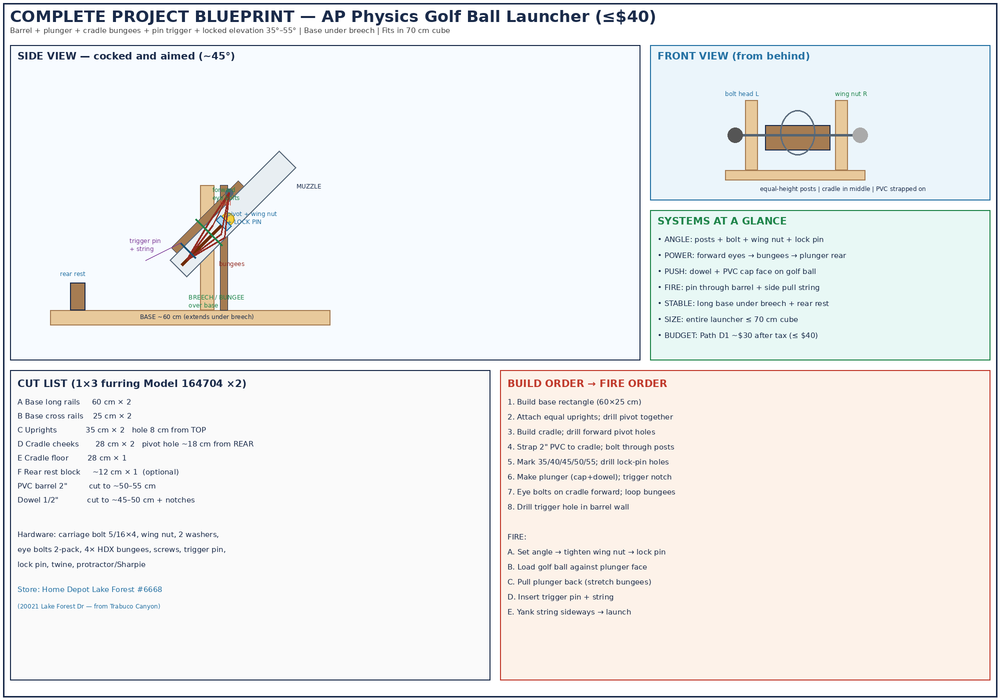
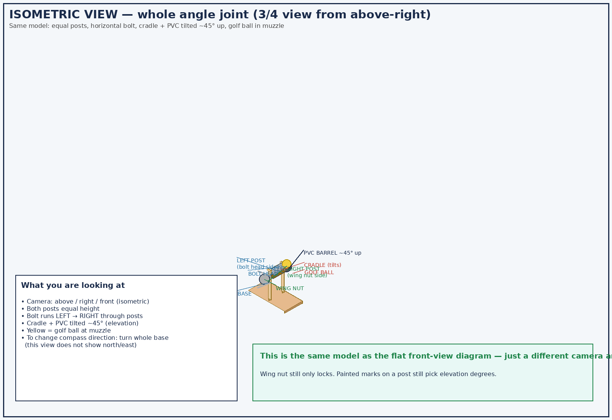
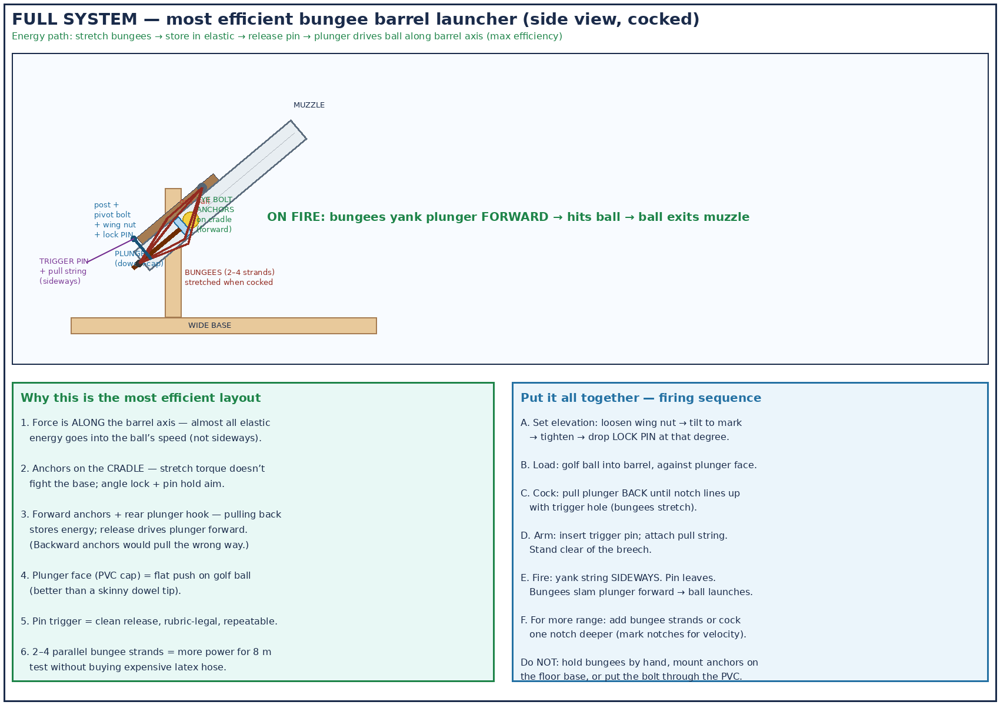
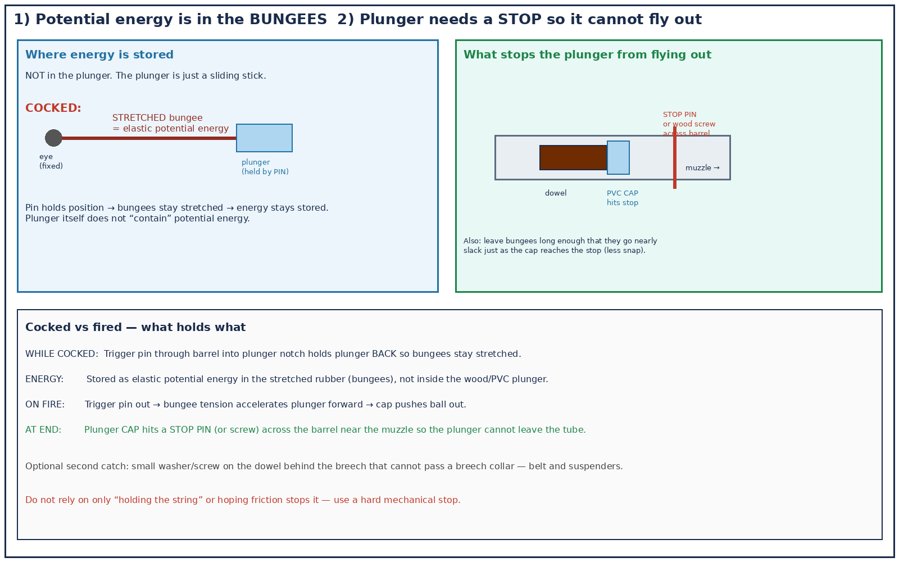
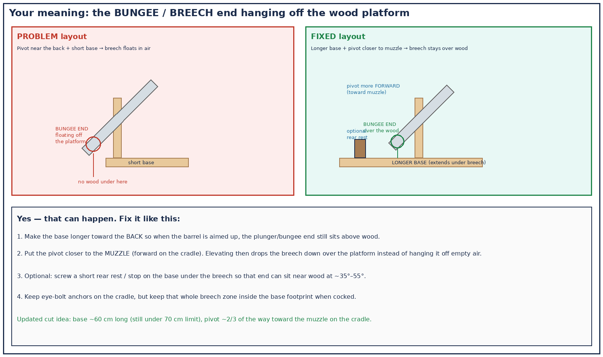
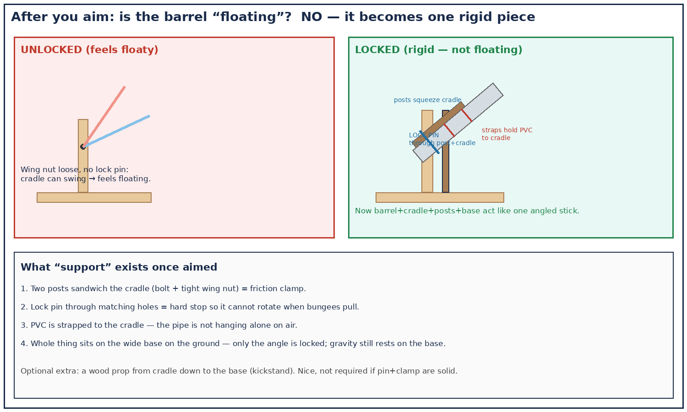
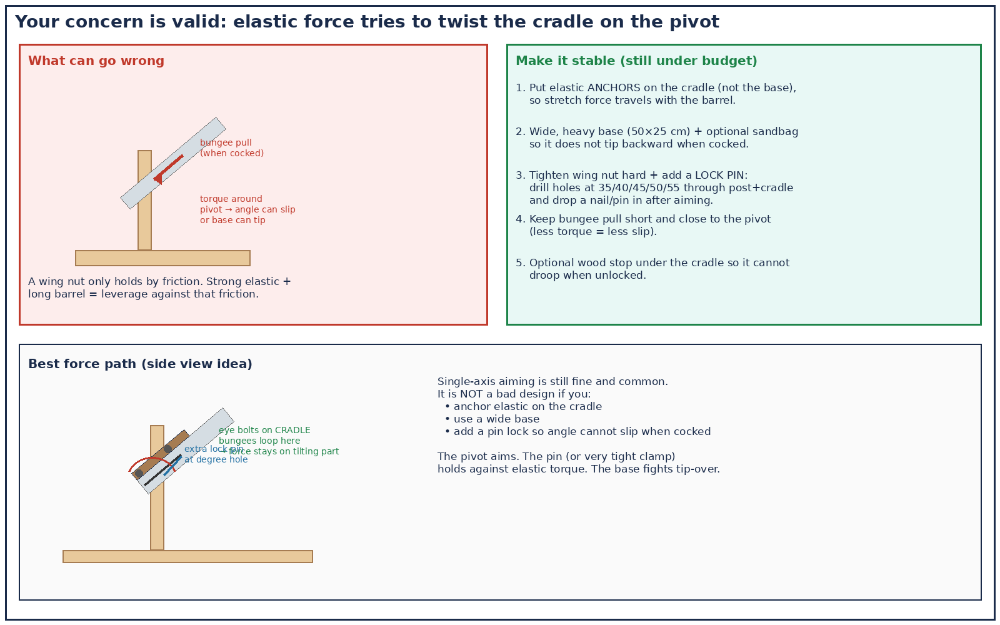
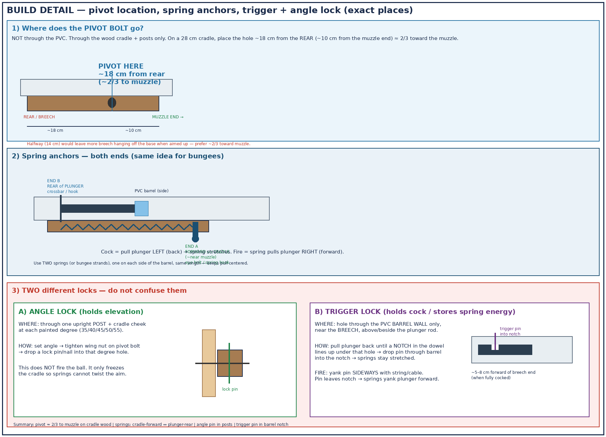
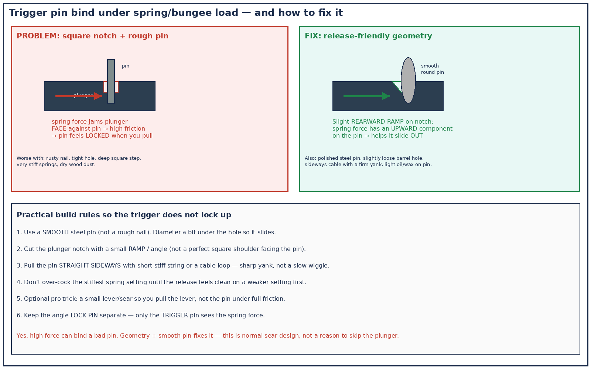
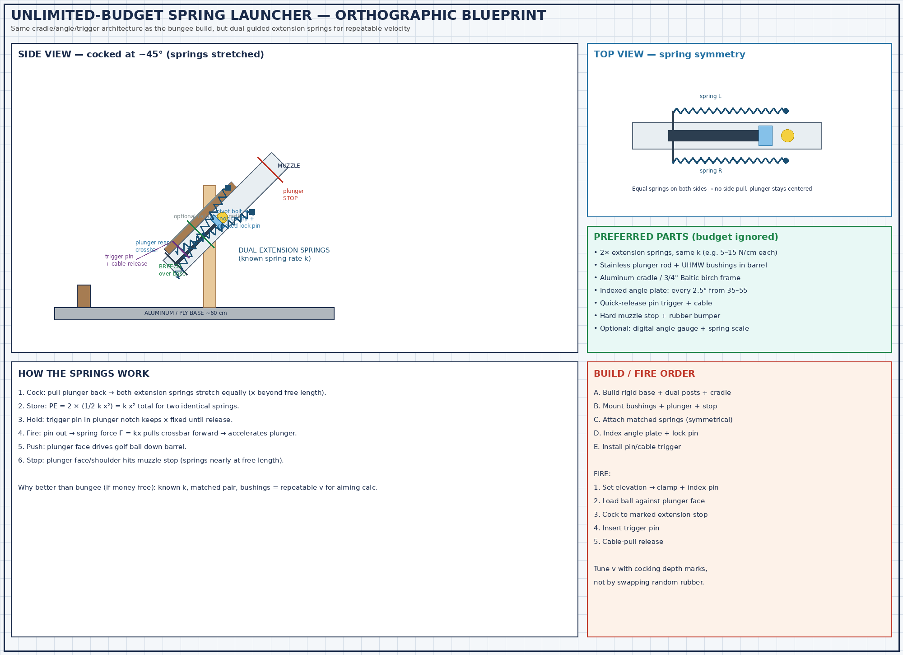

# AP Physics Projectile Launcher — Complete Project Pack

**Student location:** Trabuco Canyon, CA  
**Hard budget:** **$40 max** (keep every receipt)  
**Path D1 estimate:** ~$27.71 + ~$2.15 tax ≈ **$29.86**  
**Primary store:** Home Depot Lake Forest #6668 — 20021 Lake Forest Dr (~5.4 mi)

This document is the full project: requirements, shopping list, cut list, build, how every system works, fire procedure, testing, and scoring checklist.

---

## 0) Master blueprint (everything in one picture)



---

## 1) Assignment requirements (must all pass)

| Requirement | How this design meets it |
|---|---|
| Launch a **golf ball** into a ~70 cm target, 4–6 m away, up to 1.5 m elevated | 2" Sch 40 PVC barrel + elastic plunger can reach competition range and **≥8 m** test-fire |
| Fit in a **70 cm cube** | Base ~60 cm; barrel ~50–55 cm; height with posts ~40 cm |
| Propulsion through a **barrel or track** (no catapult/trebuchet) | PVC barrel + sliding plunger |
| **≥5 calibrated angles** covering **35°–55°** | Pivot cradle; marks + lock-pin holes at 35/40/45/50/55 |
| **Trigger** released without contacting other parts | Pin through barrel + side pull-string |
| **No prefabricated launch mechanism** | Pipe, wood, fasteners, bungee — you build it |
| **≤ $40** with receipts | Path D1 cart below |
| Velocity from **distance + angle only** (no stopwatch) | Typed data table + range formula |
| Test-fire **≥ 8 m** | 3–4 bungee strands + deep cocking notch |

**Banned:** 1½" PVC (ball won’t fit), catapults/trebuchets, prefab launchers, latex hose (~$24 — blows budget).

---

## 2) Design summary (how the whole machine works)

```text
GROUND: wide wood base (breech end sits OVER the wood)
   └── two equal-height posts (left & right of cradle)
         └── horizontal carriage bolt + washers + wing nut
               └── wood cradle (tilts) with PVC strapped on
                     ├── forward eye bolts + bungees → rear of plunger
                     ├── plunger = dowel + PVC cap face
                     ├── golf ball in front of cap
                     └── trigger pin through barrel into plunger notch
```

**Three separate jobs**

| Job | What you adjust | Purpose |
|---|---|---|
| Elevation angle | Tilt cradle to painted mark; lock wing nut + lock pin | Aim up/down (35°–55°) |
| Launch speed | How far you pull plunger / how many bungee strands | Range / velocity |
| Fire | Pull trigger string sideways | Release without holding elastic |

**Compass direction** (e.g. 50° north of east) = turn the **whole base** on the floor. That is not the cradle joint.

---

## 3) Shopping list — Path D1 (buy these exact items)

### Home Depot Lake Forest (almost everything)

| # | Item | Identifiers | Qty | ~Price |
|---|---|---|---|---|
| 1 | 2 in. × 2 ft PVC DWV Sch 40 | Internet `100585960` · SKU `276902` · Model `PVC072000200HA` | 1 | $6.98 |
| 2 | 2 in. PVC Sch 40 pressure cap | Internet `203811678` · SKU `232777` · Model `PVC021161600HD` | 1 | $2.60 |
| 3 | 1/2 in. × 48 in. hardwood dowel | Internet `203334064` · SKU `148159` · Model `10001804` | 1 | $2.18 |
| 4 | 1×3×8 ft furring strip | Model `164704` | **2** | ~$2.47 ea ($4.94) |
| 5 | 5/16-18 × 4 in. carriage bolt | Internet `204633697` · SKU `654000` · Model `800186` | 1 | $0.81 |
| 6 | 5/16-18 wing nut 3-pack | Internet `317479001` · SKU `1006605369` · Model `828911` | 1 | $1.38 |
| 7 | 5/16 in. flat washers | Bulk bin | 2–4 | ~$1.00 |
| 8 | 1/4 × 4 in. eye bolts 2-pack | Internet `204273514` · SKU `668094` · Model `816751` | 1 | $1.47 |
| 9 | Long nail / pin ~3–4 in. | Bulk (trigger + lock pin) | 2 | ~$0.50 |
| 10 | #8 × 1-1/4 in. wood screws | Bulk ~20 | 1 | ~$2.00 |
| 11 | HDX 48 in. standard bungee | Model `JB48OPB` · Internet `206802336` | **4** | ~$0.40 ea ($1.60) |

### Cheap extras

| # | Item | Where | ~Price |
|---|---|---|---|
| 12 | School protractor | Dollar Tree / school | ~$1.25 |
| 13 | Twine | Dollar Tree / HD | ~$1.25 |
| 14 | Golf balls | Borrow first | $0 |

**Est. total with tax: ~$30 / $40 limit.** Keep receipts.

**Optional Path D2:** Harbor Freight HAUL-MASTER stretch cords SKU `60811` ($12.99) instead of HDX singles — only if you shorten elsewhere to stay ≤$40.


---

## 4) Cut list (from two 1×3×8 ft furring strips)

Actual 1×3 size ≈ **0.75" × 2.5"**.

| Part | Qty | Length | Drill / notes |
|---|---|---|---|
| A — Base long rails | 2 | **60 cm** | Longer base so breech/bungee end stays **over wood** |
| B — Base cross rails | 2 | 25 cm | |
| C — Uprights | 2 | 35 cm | 5/16" hole **8 cm from top**; clamp both and drill together |
| D — Cradle cheeks | 2 | 28 cm | 5/16" hole **~18 cm from rear** (pivot closer to muzzle), 3 cm up from bottom |
| E — Cradle floor | 1 | 28 cm | Between cheeks |
| F — Rear rest (optional) | 1 | ~12 cm | Block on base under breech |
| PVC barrel | 1 | 50–55 cm | From the 2 ft pipe |
| Dowel plunger | 1 | 45–50 cm | Trigger notch + optional velocity notches |


---

## 5) Build instructions (in order)

### Step 1 — Base (platform under the breech)
1. Screw A+B into a **60 × 25 cm** rectangle.
2. Optional: screw rear rest **F** near the back end.
3. Confirm footprint &lt; 70 cm.

### Step 2 — Posts (left and right of cradle — same height)
1. Screw uprights **C** to the base, ~3–4 in apart (cradle fits between).
2. Clamp both uprights; drill one 5/16" pivot hole through both (8 cm from top).
3. Posts never tilt. Bolt head on **left**, wing nut on **right** (or swap).


### Step 3 — Cradle + PVC
1. Screw cheeks **D** to floor **E** (U-channel).
2. Strap/zip-tie **2" PVC** on the cradle floor (bolt does **not** go through PVC).
3. Bolt sandwich:  
   `bolt head → left post → washer → left cheek → floor → right cheek → washer → right post → wing nut`



### Step 4 — Angle scale + lock pins
1. Use a protractor on the barrel centerline.
2. Paint **35 / 40 / 45 / 50 / 55** on the outside of one upright.
3. Mark a pointer on the cradle cheek.
4. Drill matching **lock-pin holes** through post + cradle at each mark.
5. To aim: loosen wing nut → tilt to mark → tighten → drop lock pin.


### Step 5 — Plunger
1. Drill center of PVC cap; fasten dowel.
2. File trigger notch near rear of dowel (add extra notches for velocity settings).
3. Cap face pushes the golf ball.

### Step 5b — Plunger STOP (so it cannot fly out)
1. Near the **muzzle**, drill a hole across the barrel and insert a **stop pin** (or long wood screw) that the **PVC cap** cannot pass.
2. Leave enough room for the ball to exit ahead of that stop.
3. Optional backup: a washer/screw collar on the dowel at the breech that cannot pull through a breech ring.
4. Size bungee length so they are nearly slack when the cap reaches the stop (less violent snap).

**Do not** rely on friction alone to keep the plunger in the pipe.

### Step 6 — Bungee power (most efficient layout)
1. Screw **eye bolts into the cradle near the muzzle/forward end**.
2. Cut hooks off HDX bungees; loop **2–4 strands** from eyes to a cross-pin on the **rear of the plunger**.
3. Pulling plunger **back** stretches bungees; release drives plunger **forward** along the barrel.



### Step 7 — Trigger
1. Drill a small hole through the barrel wall lining up with the plunger notch when cocked.
2. Tie twine to a smooth pin.
3. Fire by yanking string **sideways** only — do not hold the elastic by hand.

### Energy storage vs what holds the plunger



| State | What holds the plunger | Where energy is |
|---|---|---|
| **Cocked** | **Trigger pin** through barrel into plunger notch | Elastic potential energy in **stretched bungees** (not “inside” the plunger) |
| **Firing** | Nothing holds it back — bungee tension accelerates it forward | PE → kinetic energy of plunger (+ then ball) |
| **End of stroke** | **Stop pin** across barrel that the PVC **cap** hits | Bungees nearly slack; plunger stays in the tube |

The plunger is only a sliding pusher. Stretching the bungees stores the energy; the trigger pin keeps that stretch; the stop pin keeps the plunger from launching out after the ball.

### Step 8 — Keep breech over wood
With the longer base + forward pivot, the bungee/plunger end should sit **above the platform** when aimed 35°–55°, not hanging in empty air.



---

## 6) Why this is stable (not “floating”)

| Concern | Answer |
|---|---|
| Only one pivot? | Fine for aiming. After aim, **wing nut + lock pin** freeze the cradle so barrel+cradle+posts+base act as one rigid piece. |
| Elastic torque slips angle? | Lock pin through degree holes; anchors on cradle; wide base. |
| Bungee end off the platform? | Long base + pivot toward muzzle + optional rear rest. |
| Bolt through the PVC? | **No.** Bolt through wood cradle only. |

  


---

## 7) Fire procedure (competition-ready)

1. **Aim:** loosen wing nut → pointer to calculated degree → tighten → insert **lock pin**.  
2. **Load:** golf ball in barrel against plunger face.  
3. **Cock:** pull plunger back to chosen notch (bungees stretch).  
4. **Arm:** insert trigger pin; clear the breech area.  
5. **Fire:** pull string sideways → pin out → plunger forward → ball launches.  
6. **Miss?** Adjust angle and/or cocking notch; up to 3 shots in 6 minutes.

---

## 8) Data & calculations (15 rubric points)

### Velocity (no stopwatch)
On flat ground at fixed angle θ, measure range R over enough trials. Average R, then:

\[
v = \sqrt{\frac{R g}{\sin 2\theta}}
\]

(use elevated-target form when height difference matters).

### Competition prep
- Typed data table of trials  
- Show work for v  
- Pre-solve angles for min/max target distances (4 m and 6 m) and up to 1.5 m elevation  
- First launch must use your **calculated** angle  

---

## 9) Scoring checklist (self-grade before impound)

**Construction (30)**
- [ ] Elastic propulsion launches ball  
- [ ] ≤ 70 cm in all dimensions  
- [ ] Functional pin trigger (no hand-hold release)  
- [ ] ≥5 angles covering 35°–55°, marked  
- [ ] No prefab launch mechanism  
- [ ] Neat, strong, symmetric (compensatory aesthetics)

**Launches (50)**
- [ ] 1st shot uses calculated angle  
- [ ] Up to 3 shots / 6 minutes toward target scoring rings  

**Data (15)**
- [ ] Typed velocity table  
- [ ] Correct velocity work  
- [ ] Min/max target angles  
- [ ] Competition angle/velocity calc  

---

## 10) Safety

- Never stand behind the cocked plunger  
- Pin trigger only — no hand-held elastic release  
- Eye protection recommended during test-fire  
- Clear downrange before every shot  

---

## 11) Store route from Trabuco Canyon


1. Home Depot Lake Forest #6668 — main cart  
2. Harbor Freight Lake Forest — only if Path D2 elastics  
3. Dollar Tree — protractor/twine if needed  

---

## 12) Extra diagrams index

| File | What it shows |
|---|---|
| `assets/complete-project-blueprint.png` | Everything on one sheet |
| `assets/full-system-bungee-launcher.png` | Bungee + plunger + trigger + fire sequence |
| `assets/angle-joint-step-by-step-blueprint.png` | Cut list and angle joint assembly |
| `assets/metal-parts-simple.png` | Bolt = axle, washers = protect, wing nut = brake |
| `assets/elevation-vs-azimuth.png` | Up/down angle vs compass aim |
| `assets/launcher-perspective-view.jpg` | 3/4 photo-style view |
| `assets/path-d1-product-collage.png` | What to buy |

---

**Bottom line:** Build the wood cradle between two posts, lock elevation with bolt/wing-nut/pin, power with cradle-mounted forward bungees into a plunger, fire with a side-pull pin, keep the breech over the base, stay under $40, and bring typed velocity data.

---

## 12b) Build clarifications — pivot, springs, trigger (exact places)



### Where is the pivot bolt?
- **Not through the PVC.** Only through **posts + wood cradle**.
- On a **28 cm cradle**, drill the pivot **~18 cm from the rear** (~10 cm from the muzzle end) ≈ **2/3 of the way toward the muzzle**.
- Halfway (14 cm) works mechanically but leaves more breech hanging off the base when aimed up — **prefer ~2/3 to muzzle**.

### Where do both spring (or bungee) ends anchor?
| End | Mount on | Location |
|---|---|---|
| **A (fixed)** | **Cradle** | Forward, toward the **muzzle** (eye bolt / spring hook on cradle wood) |
| **B (moving)** | **Plunger** | **Rear** of plunger (crossbar or hook on the dowel behind the breech) |

Use **two** springs/strands, one on each side of the barrel, same length.  
Cock = pull plunger **back** (stretch). Fire = springs pull plunger **forward**.

### Two locking systems (different places)

**A — Angle lock** (holds elevation 35–55°)  
- Hole through **upright post + cradle cheek** at each painted degree.  
- Set angle → tighten wing nut → drop **lock pin**.  
- Does **not** fire the ball.

**B — Trigger lock** (holds cock / stores spring energy)  
- Hole through the **PVC barrel wall only**, near the **breech**.  
- When plunger is fully cocked, a **notch in the dowel** lines up under that hole (~5–8 cm forward of the breech end).  
- Drop **trigger pin** into the notch; tie string/cable.  
- Fire by pulling the pin **sideways** out of the notch.

### Will the trigger pin lock up under high spring/bungee force?

**It can — if the notch is a square step and the pin is rough.** Spring force shoves the plunger into the pin, friction skyrockets, and a sideways pull feels stuck.



**Fixes (build these in):**
1. **Smooth steel pin**, slightly loose in the barrel hole (not a rusty nail).
2. Cut the plunger notch with a slight **rearward ramp** so spring force has a component that helps push the pin **out**, not only into the hole wall.
3. Pull **straight sideways** with a short stiff string/cable — firm yank.
4. Test release on a lighter cock first; then go to full power.
5. Optional: a small lever that pulls the pin for you (more force, same idea).

This is normal for pin/sear triggers — not a reason to ditch the plunger. Angle lock pin is separate and does not see this load.

---

## 13) Optional unlimited-budget variant — dual guided springs

If money were not a limit, swap the HDX bungees for **two matched extension springs** on opposite sides of the barrel. Keep the same cradle, angle lock, pin trigger, muzzle stop, and long base.



**What changes vs Path D1**
- Dual **extension springs** with known rate \(k\), anchored forward on the cradle and on a plunger rear crossbar
- Stainless plunger rod + bushings so it doesn’t bind
- Indexed angle plate + stronger clamp
- Cable-style trigger release (still a pin; still rubric-legal)

**Energy:** cocking stretches both springs by \(x\);  
\( PE = 2 \times \tfrac12 k x^2 = k x^2 \) (identical pair).  
Release → force \(F = kx\) accelerates the plunger → ball launch → plunger hits muzzle stop.

**Why it’s “better” when budget is open:** more repeatable velocity for calculated aiming, cleaner Hooke’s-law lab story, less rubber creep.  
**For the real $40 project:** still use the bungee Path D1 build above.
